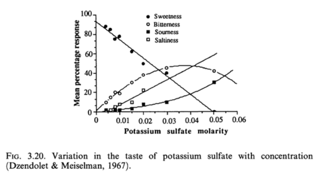

========================================================

[Report1](http://rstudio-pubs-static.s3.amazonaws.com/24803_abbae17a5e154b259f6f9225da6dade0.html)
[Report2](https://www.minitab.com/en-us/Published-Articles/Wine-Tasting-by-Numbers--Using-Binary-Logistic-Regression-to-Reveal-the-Preferences-of-Experts/)
[When a wine is salty, and why it shouldn?t be](http://wineoscope.com/2015/10/02/when-a-wine-is-salty-and-why-it-shouldnt-be/)
[Chloride concentration in red wines: influence of terroir and grape type](http://www.scielo.br/scielo.php?pid=S0101-20612015000100095&script=sci_arttext)
[Vinho Verde on Wikipedia](https://en.wikipedia.org/wiki/Vinho_Verde)
[Box-Cox Normality Transformation](http://www.itl.nist.gov/div898/handbook/eda/section3/boxcoxno.htm)

Wine Production and Quality By Keith Grainger, Hazel Tattersall


```{r echo=FALSE, message=FALSE, warning=FALSE, packages}
# Load all of the packages that you end up using
# in your analysis in this code chunk.

# Notice that the parameter "echo" was set to FALSE for this code chunk.
# This prevents the code from displaying in the knitted HTML output.
# You should set echo=FALSE for all code chunks in your file.

library(ggplot2)
library(gridExtra)
library(dplyr)
library(GGally)
library(corrgram)
library(car) # for powerTransform
```

# Abstract
This project is an effort towards partial fulfilment of the requirements for the Udacity's Data Analyst Nanodegree.

The purpose is to perform an Exploratory Data Analysis (mono-, bi- and multivariate) on a dataset containing physicochemical measurements and tasting results of a sample of red wines.

# Goal of the data analysis
Our goal with this dataset is to investigate how the chemical qualities of the wine affect its quality. Ideally, we would be able to come up with a regression model that will enable us to predict the quality of wine given its chemical properties.

As the authors of the dataset mention in their notes, it is possible that there are correlations between some of the measured quantities. Therefore, in the course of our work we will try to detect any such interactions between the variables.

# Dataset loading and some preliminary cleaning

We start by loading the dataset (stored in a CSV file) into a data.frame:


```{r echo=FALSE, Load_the_Data}
# Load the Data
w <- read.csv("wineQualityReds.csv")
```
Some information about the number and the structure of the observations
```{r echo=FALSE, Dataset_structure}
str(w)
```

We see that there are 1599 observation of wines, each one containing 13 variables. We can safely remove the "X" column as it simply repeats the natural index of the observations. 
```{r echo=FALSE, Removing_X_column}
w$X <- NULL
```
The rest of the variables are numeric. This is valid for most of them, since they are results of laboratory measurements. However, the "quality" variable is the tasting result, which is categorical variable having an ordinal scale. Therefore, we can convert this variable to an ordered factor, assuming that a higher number indicates a higher quality.

```{r echo=FALSE, Converting_quality_to_factor}
w$quality <- factor(w$quality, ordered = T)
str(w)
```

In this last "str" output we clearly see that "quality" is now represented by a 6-level ordered factor with the following levels:

```{r echo=FALSE, quality_levels}
levels(w$quality)
```

We test the data for any missing (NA) or numerically bad (NaN) data--there is no such data (`r all(!is.na(w))`).

Otherwise, the dataset is already in a **"tidy"** state--a row per observation, with all observation attributes in separate columns. 

# Univariate Plots Section
In this section we perform initials statistical and graphical analysis of the variables contained in the dataset.


## Fixed acidity
```{r echo=FALSE, Uniplot_fixed_acidity}

plotVar <- function(v,d) {
  name <- deparse(substitute(v))
  q1 <- qplot(data=d, x=v, fill=I("blue"), color=I("black"), alpha=0.5, xlab=name) + 
        theme(legend.position="none")

  q2 <- qplot(data=d, x=v, geom="density", xlab=name, fill=I("blue"), alpha=0.5) + 
		geom_rug() + 
        theme(legend.position="none")

  q3 <- qplot(0, data=d, y=v, geom="boxplot", ylab=name) + 
		theme(axis.title.x=element_blank())

  grid.arrange(q1, q2, q3, layout_matrix=matrix(c(1,2,3,3), 2, 2))
}

summary(w$fixed.acidity)
plotVar(w$fixed.acidity, w)
```

```{r echo=FALSE, useful_functions}
# Pearson’s measure of kurtosis
kurtosis <- function(x) {
	n <- length(x)
	z <- (x - mean(x)) / sd(x)
	sum(z^4)/n - 3
}

# Pearson's moment coefficient of skewness
skewness <- function(x) {
  n <- length(x)
  z <- (x - mean(x)) / sd(x)
  sum(z^3)/n
}
```

The *fixed acidity* features somewhat normal distribution with some right-skewedness (skewness = `r skewness(w$fixed.acidity)`) and relatively long tail (excess kurtosis = `r kurtosis(w$fixed.acidity)`).  

The boxplot identifies many values as outliers.

## Volatile acidity
```{r echo=FALSE, Uniplot_volatile_acidity}
summary(w$volatile.acidity)
plotVar(w$volatile.acidity, w)
```

The *volatile.acidity* has a similar right-skewed distribution (skewness = `r skewness(w$volatile.acidity)`) and a similarly long tail (kurtosis = `r kurtosis(w$volatile.acidity)`). 

The distribution seems a bit multi-modal. We can see this on a higher-resolution histogram.

```{r echo=FALSE, Uniplot_volatile_acidity_hires}

qplot(data=w, x=volatile.acidity, fill=I("blue"), color=I("black"), alpha=0.5,
	  binwidth = 0.01) + 
      theme(legend.position="none")
```

The boxplot again identifies several values as outliers. 

## Citric acid
```{r echo=FALSE, Uniplot_citric_acid}
summary(w$citric.acid)
plotVar(w$citric.acid, w)
```

The *citric.acid* variable has many values equal to 0, as well as one value equal to 1 (also shown by the boxplot as an outlier). This outlier can be either a data entry error, or a wine that has excessive amount of citric acid (more than the limit of the measuring instrument). 

As the value table below shows, the resolution of the measurement has been only 0.01 g/dm~3~, which means that all wines containing less than that will appear as 0 in the dataset.

```{r echo=FALSE, Uniplot_citric_acid_table}
table(w$citric.acid)
```

We can get a better idea about the distribution by eliminating values 0 and 1. We will also adjust the `binwidth` to correspond to the measurement resolution.

```{r echo=FALSE, Uniplot_citric_acid_cleaned}
cleaned.citric.acid = subset(w, citric.acid != 0 & citric.acid != 1)

q1 <- qplot(data=cleaned.citric.acid, x=citric.acid, binwidth=0.01, 
			fill=I("blue"), color=I("black"), alpha=0.5) + 
			theme(legend.position="none")
	  
q2 <- qplot(data=cleaned.citric.acid, x=citric.acid, geom="density") + geom_rug()

grid.arrange(q1, q2, nrow=2)
```

This distribution appears **artificially** uniform towards the lower values (i.e. there is no gradual reduction of the frequency of the lower values). This can be probably explained with the fact that the winemakers usually add some amount of citric acid to give the wine a fresh (non-flat) body. Further confirmation for this is the presence of three very prominent peaks in the histogram (at 0.02, 0.24 and 0.49); especially the last two can signify that the citric amount has been artificially boosted to 0.25 or 0.50. If the citric acid amounts were due to a *natural process* (like fermentation, as is the case with the other acids), then its distribution would be more *bell-shaped* (the central limit theorem calls for normal distribution of the combined effect of many random processes.)

## Residual sugar
```{r echo=FALSE, Uniplot_residual_sugar}
summary(w$residual.sugar)
plotVar(w$residual.sugar, w)
```

The IQR range (`r IQR(w$residual.sugar)`) of the *residual.sugar* values is pretty small compared to the total range (`r diff(range(w$residual.sugar))`). This signifies that we're dealing with wines of mostly the same class of sweetness; which is not surprising given that the *"Vinho Verde"* region produces predominantly very fresh wines.

We can classify the wines in terms of sweetness according to the scale mandated by EU directive 753/2002. This scale runs like this:

Sugar content [g/dm^3^] | < 4 |  (4, 12]   |  (12, 45] | > 45
------------------------|-----|------------|-----------|------
Sweetness               | Dry | Medium Dry |    Medium | Sweet

We create a new ordered factor called `sweetness` in the original dataframe having levels corresponding to the sweetness degrees above. As the frequency table below shows most of the wines are "dry".

```{r echo=FALSE, Uniplot_sweetness_bins}
w$sweetness <- cut(w$residual.sugar, 
					c(0,4,12,45, Inf), 
					labels=c("dry", "medium.dry", "medium", "sweet"), 
					ordered_result=T)
					
table(w$sweetness)
```

## Chlorides
```{r echo=FALSE, Uniplot_chlorides}
summary(w$chlorides)
plotVar(w$chlorides, w)
```

The amount of NaCl (*chlorides*) also shows a bell-shaped distribution with a long tail (excess kurtosis = `r kurtosis(w$volatile.acidity)`). Most values are again concentrated in a small region (IQR=`r IQR(w$chlorides)` compared to range=`r diff(range(w$residual.sugar))`). This can be explained by the fact that all wines come from a geographically constrained region; it is known that the soil type and micro-climatic conditions of the region have direct influence on the salinity of the wine. Interestingly, some countries limit the amount of chlorides accepted in a wine (e.g. in Brazil it is 0.2 g/dm^3^, while in Australia it is 0.6 g/dm^3^). Generally, levels above 0.5 g/dm^3^ start to give the sensory perception of saltiness (although it depends on the national diet). There is one "outlier" wine in the sample that can trigger a "salty" grimace of the taster.


## Free SO~2~
```{r echo=FALSE, Uniplot_freeSO2}
summary(w$free.sulfur.dioxide)
plotVar(w$free.sulfur.dioxide, w)
```

The winemakers use SO~2~ as an antioxidant and disinfectant. Before bottling the wine they adjust the levels of free SO~2~ usually between 10 and 40 mg/dm^3^ (careful producers relate the amount of SO~2~ to the pH--red wines with low pH need less SO~2~ than ones with higher pH). This range is also pretty visible in the histogram above.


## Total SO~2~
```{r echo=FALSE, Uniplot_totalSO2}
summary(w$total.sulfur.dioxide)
plotVar(w$total.sulfur.dioxide, w)
```

In Europe the permitted level of total SO~2~ is 150 mg/dm^3^ for dry red wines (200 mg/dm^3^ for sugar levels above 5 g/dm^3^). This requirement is also visible from the graphs above. There are two wines that surpass significantly this limit (theoretically they can't be sold on the EU market, but this is possible for the US where the permitted level is 300 mg/dm^3^).


## Density
```{r echo=FALSE, Uniplot_density}
summary(w$density)
plotVar(w$density, w)
```

The *density* variable follows a normal distribution (Shapiro-Wilk gives `r shapiro.test(w$density)$statistic` at P=`r shapiro.test(w$density)$p.value`). The Normal Q-Q plot below confirms this, but indicates also some heavier tails (hence the outliers in the boxplot).

```{r echo=FALSE, Uniplot_density_qq}
qqnorm(w$density); qqline(w$density)
```

## pH
```{r echo=FALSE, Uniplot_PH}
summary(w$pH)
plotVar(w$pH, w)
```

The *pH* variable also follows a normal distribution (Shapiro-Wilk gives `r shapiro.test(w$pH)$statistics` at P=`r shapiro.test(w$pH)$p.value`). The Normal Q-Q plot below confirms this, but indicates also some heavier right tail (hence the outliers in the boxplot).

```{r echo=FALSE, Uniplot_ph_qq}
qqnorm(w$pH); qqline(w$pH)
```
 
The mean pH lies at 3.3 which is consistent with the observation that the wines of "Vinho Verde" are pretty acid and fresh.

## Sulfates
```{r echo=FALSE, Uniplot_sulfates}
summary(w$sulphates)
plotVar(w$sulphates, w)
```

The *sulfates* variable (measuring predominantly the amount of K~2~SO~4~) has a bell-shaped right-skewed distribution, with longer right tail. 

Normally fresh (not very old) wines contain around 0.4-0.7 g/dm^3^ of K~2~SO~4~ which is very well seen in the histogram (median 0.62).

## Alcohol
```{r echo=FALSE, Uniplot_alcohol}
summary(w$alcohol)
plotVar(w$alcohol, w)
```

The *alcohol* content shows a significant right-skewedness (skewness = `r skewness(w$alcohol)`). As for all right-skewed distributions, this is due to a value limit situated on the left. This limit is the stipulation of the European legislation for minimum alcohol content to be min. 8.5% and max. 15%. We see this values clearly in the statistics above.


## Quality

The *quality* variable is categorical, so we will plot it in a barplot
```{r echo=FALSE, Uniplot_quality}
summary(w$quality)
qplot(w$quality, color=I("black"), fill=I("orange"))
```

We see that the majority of wines are in the middle quality range.

# Univariate Analysis

### What is the structure of your dataset?

The dataset contains 1599 observations of red wines from the Portuguese region "Vinho Verde". Each observation has 11 inputs (chemical measurements) and 1 output (subjective sensory assessment of quality).

All laboratory measurements (*input* variables) are numeric and have the following meaning (in brackets are the units of measurement):

* **Fixed acidity** [g/dm^3^] - the amount of "good" non-volatile acids (e.g. malic, tartaric)
* **Volatile acidity** [g/dm^3^] - the amount of "bad" acids (mostly acetic acid)
* **Citric acid** [g/dm^3^] - the amount of citric acid
* **Residual sugar** [g/dm^3^] - the amount of sugar left after the fermentation has ended
* **Chlorides (mostly NaCl)** [g/dm^3^] - the amount of salts in the wine
* **Free sulfur dioxide (SO~2~)** [mg/dm^3^] - the free form of SO~2~ exists in equilibrium between molecular SO~2~ (as a dissolved gas) and bisulfite ion; it prevents microbial growth and the oxidation of wine.
* **Total sulfur dioxide (SO~2~)** [mg/dm^3^] - amount of free and bound forms of SO~2~; in low concentrations, SO~2~ is mostly undetectable in wine, but at free SO~2~ concentrations over 50 ppm, SO~2~ becomes evident in the nose and taste of wine.
* **Density** [kg/dm^3^] - the density of is close to that of water [1kg/dm3] depending on the percent alcohol and sugar content
* **pH** - describes the acidity of the wine: 0 (very acidic) to 14 (very basic)
* **Sulfates (mostly K~2~SO~4~)** [g/dm^3^] - a wine additive which can contribute to sulfur dioxide gas (SO~2~) levels, which acts as an antimicrobial and antioxidant agent.
* **Alcohol** [% by volume] - the percentage of alcohol content

The *output* variable is the factor **quality** having the following ordinal scale: 0 (lowest) to 10 (highest). The value of this variable is obtained as the median of three subjective sensory tasting assessments performed by different oenologists. The measured wines are in the range 3-8, i.e. no wine was classified as "very bad" or "excellent".


### What is/are the main feature(s) of interest in your dataset?

Our interest lies in finding a relationship that can predict the wine *quality* based on the various *chemical* measurements. It is not very easy to make apriori assumptions as to which chemical variables have a significant effect on the sensory perception of the wine. Still, what comes first to mind is the *alcohol* content and the *pH*, both being aspects that are very easily perceived. Of the other chemical substances, the measured *chloride* contents is mostly below the detection threshold. Likewise, *sulphur dioxide (aka sulfites)* have neither smell, nor taste, so it is not very likely that they can directly determine the tasting assessment. On the other hand, the *sulphates* can have very different tastes depending on their concentration, as shown on the diagram below.



### What other features in the dataset do you think will help support your investigation into your feature(s) of interest?

*Citric acid* gives a freshness to the wine, and as such will probably affect positively the tasting. Contrarily to it, the *acetic* acid (quantified by the *volatile.acidity* variable) will give an unpleasant characteristic vinegar taste. We have to keep in mind that higher acidity will correlate with low levels of pH, therefore it is important to distinguish the case when low pH is due to the bad "acetic" acid.

### Did you create any new variables from existing variables in the dataset?

A new categorical variable `sweetness` was created to classify each wine according to its residual sugar content. It has the following levels: "dry" < "medium dry" < "medium" < "sweet".

### Of the features you investigated, were there any unusual distributions? Did you perform any operations on the data to tidy, adjust, or change the form of the data? If so, why did you do this?

Most of the distributions are right-skewed. This is due to measuring quantities that cannot be below a given limit (e.g. due to some legislation). ?????????
```{r echo=FALSE, Univariate_xform2normality_alcohol}
# Normal probability plot for original variable
qqnorm(w$alcohol); qqline(w$alcohol)			
# Illustration of Log-Likelihood profile
boxcox(w$alcohol~1)	            
# Estimaton of Box-Cox lambda
p<-powerTransform(w$alcohol)    
# Box-Cox transformation
y<-bcPower(w$alcohol,p$lambda)	
# Normal probability plot for transformed variable
qqnorm(y)
```

```{r echo=FALSE, Univariate_xform2normality_citricacid}
# Normal probability plot for original variable
citracid <- subset(w, citric.acid!=0)$citric.acid
qqnorm(w$citric.acid); qqline(w$citric.acid)			
# Illustration of Log-Likelihood profile
boxcox(citracid~1)	            
# Estimaton of Box-Cox lambda
p<-powerTransform(citracid)    
# Box-Cox transformation
y<-bcPower(citracid,p$lambda)	
# Normal probability plot for transformed variable
qqnorm(y); qqline(y)
hist(y)
shapiro.test(y)
hist(citracid)
shapiro.test(citracid)
```


# Bivariate Plots Section

A generic scatter matrix:
```{r echo=FALSE, Bivariate_Plots_ggpairs}
ggpairs(w[,2:13], axisLabels = "internal", title="Red Wines",
        diagonal=list(continuous="density"))
```

A correlogram follows:
```{r echo=FALSE, Bivariate_Plots_corrgram}
corrgram(w,lower.panel=corrgram::panel.ellipse, upper.panel=panel.shade,
         diag.panel=panel.density)
```

Exploring quality:

```{r echo=FALSE, Bivariate_Plots_quality_cond}

plotStat <- function(x) {
  yname <- strsplit(deparse(substitute(x)),"$",fixed=TRUE)[[1]][2]
  yname <- paste("median(", yname, ")", sep="")
  summary.func <- median
  ggplot(aes(x=as.numeric(quality), y=x), data=w) +
        geom_line(stat="summary", fun.y=summary.func) + 
        geom_point(stat="summary", fun.y=summary.func) + 
        ylab(yname) + 
        xlab("quality")
}

q1 <- plotStat(w$alcohol)
q2 <- plotStat(w$residual.sugar)
q3 <- plotStat(w$pH)
q4 <- plotStat(w$citric.acid)
q5 <- plotStat(w$sulphates)
q6 <- plotStat(w$volatile.acidity)
q7 <- plotStat(w$fixed.acidity)
grid.arrange(q1,q2,q3,q4,q5,q6,q7, ncol=2)
```

```{r echo=FALSE, Bivariate_Plots_quality_boxplots}

ggplot(aes(x=quality, y=density), data=w) + geom_boxplot()
ggplot(aes(x=quality, y=pH), data=w) + geom_boxplot()

```

# Bivariate Analysis

### Talk about some of the relationships you observed in this part of the investigation. How did the feature(s) of interest vary with other features in the dataset?

We see a very clear trend of increasing sensory quality with higher alcohol content. Amazingly, a similar trend is seen for the *sulphates*. *Volatile acidity* correlates negatively with quality, which was expected, given the unpleasant taste of the acetic acid. *Citric acid* on the other hand has a positive correlation, which is also not surprising, giving its "freshness" sensory effect. The other variables--*volatile acidity*, *SO~2~* contents, *residual sugar* have almost undetectable effect on the quality perception.

### Did you observe any interesting relationships between the other features (not the main feature(s) of interest)?

The correlogram shows pretty strong **positive correlation** (blue color) between:
* *fixed acidity* and *citric acid* (cor=`r cor(w$fixed.acidity, w$citric.acid)`)---not surprising, since the amount of citric acid is already included in the measurement of the total "good" acids content.
* *fixed acidity* and *density* (cor=`r cor(w$fixed.acidity, w$density)`)---this is due to the fact that the three main acids in wine (citric, malic and tartaric) have higher density than water (1.67, 1.61 and 1.79 g/cm^3^), therefore their presence increases the overall density of the wine.
* The two *SO~2~* measurements (cor=`r cor(w$free.sulfur.dioxide, w$total.sulfur.dioxide)`)---normal, since one of them is included also in the other one
* *Residual sugar* and *density* (cor=`r cor(w$residual.sugar, w$density)`)---as sugar is heavier than water (1.587 Kg/L vs. 1.000 kg/L), its presence tends to increase the overall density of the wine 

Strong **negative correlation** (red color) was found between:
* *Fixed acidity* and *pH* (cor=`r cor(w$fixed.acidity, w$pH)`)---as expected, since higher acidity manifests itself in lower pH
* The same for *citric acid* and *pH* (cor=`r cor(w$citric.acid, w$pH)`)
* *Density* and *alcohol* content (cor=`r cor(w$density, w$alcohol)`)---since alcohol has lower specific density than water (0.780 kg/L comapred to 1.000 kg/L), its presence tends to reduce the overall density (all other factors being equal)

Somewhat unexpected is the positive correlation seen for "volatile acidity" (acetic acid) and pH (normally all acids cause lower pH). This can be due to the following phenomenon [see here](http://www.aromadictionary.com/articles/volatileacidity_article.html): The "acetobacter aceti" bacteria responsible for the vinegar fermentation and the production of acetic acid thrive in wines with lower fixed acidity and SO~2~ levels. Therefore, wines with higher volatile acidity will tend to have lower fixed acidity (what we see in the negative correlation between fixed/citric and volatile acidity). This lower fixed acidity probably is not offset by the higher content of acid acidity, and therefore the pH tends to rise. Effects of "normal" and "unexpected" acidities in shown in the diagrams below.

```{r echo=FALSE, Bivariate_Plots_acidityPH}
g2 <- ggplot(aes(x=volatile.acidity, y=pH), data=w) + geom_point(alpha=0.5) +
            stat_smooth() + annotate("text", label="Unexpected", x=1.2, y=4)
g1 <- ggplot(aes(x=fixed.acidity, y=pH), data=w) + geom_point(alpha=0.5) + 
            stat_smooth() + annotate("text", label="Expected", x=12, y=4)

grid.arrange(g1, g2, ncol=2, top="Expected vs. unexpected effect of acidity on the pH")

```


### What was the strongest relationship you found?


# Multivariate Plots Section

```{r echo=FALSE, Multivariate_Plots}
plotDensity <- function(x) {
  xname <- strsplit(deparse(substitute(x)),"$",fixed=TRUE)[[1]][2]
  ggplot(aes(x=x, fill=quality), data=w) + 
		geom_density(alpha=0.4, color="black") + 
		scale_fill_brewer(type="qual") + 
		xlab(xname)
}

# Code from: https://github.com/hadley/ggplot2/wiki/Share-a-legend-between-two-ggplot2-graphs
grid_arrange_shared_legend <- function(...) {
    plots <- list(...)
    g <- ggplotGrob(plots[[1]] + theme(legend.position="right"))$grobs
    legend <- g[[which(sapply(g, function(x) x$name) == "guide-box")]]
    width <- sum(legend$width)
    grid.arrange(
        do.call(arrangeGrob, lapply(plots, function(x)
            x + theme(legend.position="none"))),
        legend,
        ncol = 2,
        widths = grid::unit.c(unit(1, "npc") - width, width))
}


p1 <- plotDensity(w$pH)
p2 <- plotDensity(w$citric.acid)
p3 <- plotDensity(w$volatile.acid)
p4 <- plotDensity(w$sulphates.acid)

grid_arrange_shared_legend(p1,p2,p3,p4)

```

# Multivariate Analysis

### Talk about some of the relationships you observed in this part of the investigation. Were there features that strengthened each other in terms of looking at your feature(s) of interest?

### Were there any interesting or surprising interactions between features?

### OPTIONAL: Did you create any models with your dataset? Discuss the strengths and limitations of your model.

library(memisc)
m1 <- lm(as.numeric(quality) ~ pH, data=w)
m2 <- update(m1, . ~ pH + alcohol, data=w)
m3 <- update(m2, . ~ pH + alcohol + volatile.acidity, data=w)
m4 <- update(m3, . ~ pH + alcohol + volatile.acidity + citric.acid, data=w)
mmtable(m1,m2,m3,m4)
plot(m4)

------

# Final Plots and Summary

### Plot One
```{r echo=FALSE, Plot_One}

```

### Description One


### Plot Two
```{r echo=FALSE, Plot_Two}

```

### Description Two


### Plot Three
```{r echo=FALSE, Plot_Three}

```

### Description Three

------

# Reflection

Finding a way to predict the sensory quality of wines based on their physicochemical properties can fullfil a dream of winemakers and oenologists.

We can go even further and imagine a model that can predict the type of the wine from the chemical measurements; or the climatic quality of the vintage year, for example.

Unfortunately the dataset does not include any measurements of *tannin* content; yet tannins (the natural polyphenols giving the astringent taste of wine) are very important for the sensory perception of wines.

